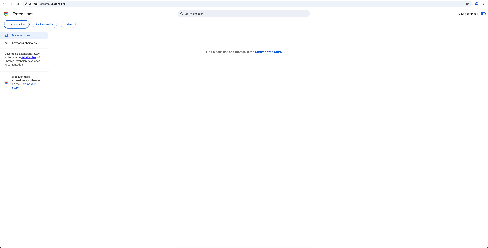
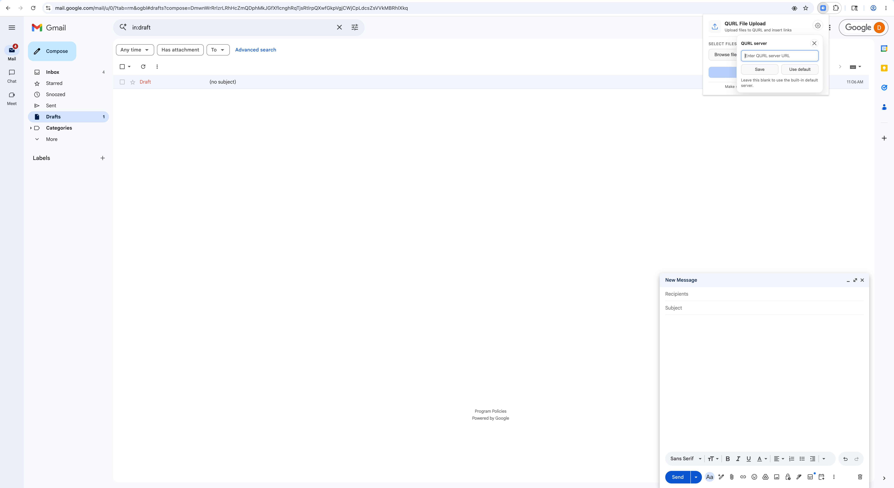
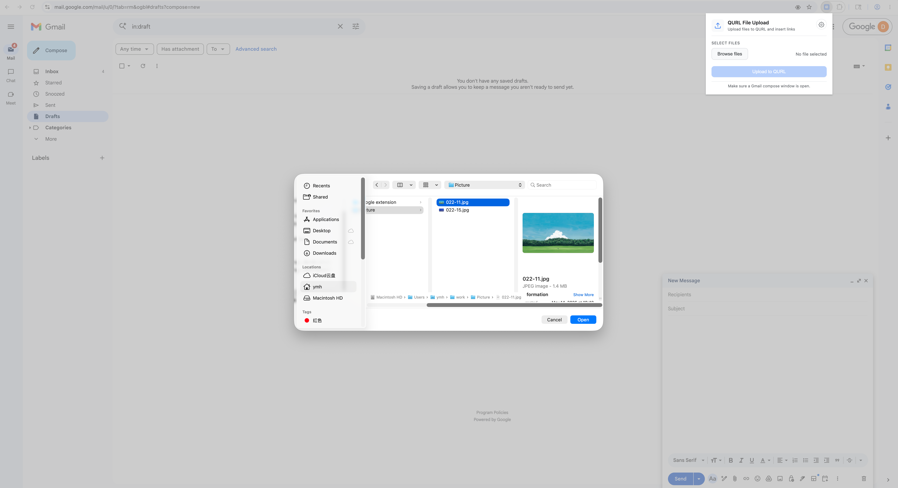
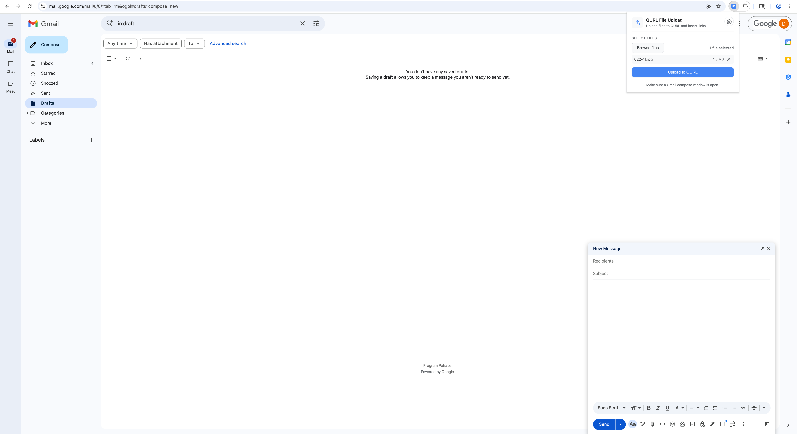
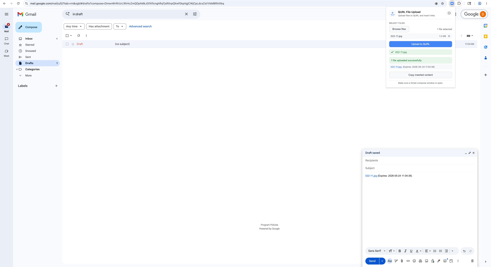
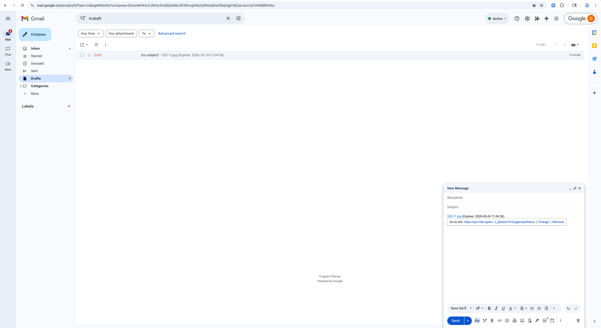

# QURL Gmail Chrome Extension Local Unpacked Test Guide

This document explains how to build the extension with `scripts/package-all.sh`, load the unpacked `release/` directory into Google Chrome, and verify the end-to-end upload flow in Gmail without using the ZIP package.

## Scope

- Build the extension locally
- Load the unpacked `release/` directory in Chrome
- Open a Gmail draft and test file upload
- Verify automatic draft insertion, manual copy fallback, and uploaded link behavior

## Prerequisites

- Google Chrome with access to `chrome://extensions`
- A Gmail account
- A running QURL upload service
- The project root at `qurl-gmail-chrome-extension/`

## 1. Build the Unpacked Release

From the project root, run:

```bash
cd qurl-gmail-chrome-extension
./scripts/package-all.sh 1.0.0
```

Notes:

- This command regenerates `release/` and also produces a ZIP file in `dist/`
- For local unpacked testing, only the `release/` directory is required
- If you want to bump the version automatically, you can use `./scripts/package-all.sh patch`, `minor`, or `major`

Expected output:

- `release/` contains the unpacked extension files used by Chrome
- `dist/` contains a ZIP package for Chrome Web Store upload, which is not needed for this local test

## 2. Load the Unpacked Extension in Chrome

1. Open `chrome://extensions`
2. Enable **Developer mode**
3. Click **Load unpacked**
4. Select the `qurl-gmail-chrome-extension/release/` directory
5. Confirm that the extension appears in the extensions list and the toolbar icon is available



## 3. Open a Gmail Draft Before Testing

Open Gmail and create a new draft before using the extension.

This matters because the content script inserts generated QURL links into the active compose body. If no compose window is open, the upload can still succeed, but draft insertion may fail and the popup will fall back to manual copy.

## 4. Open the Extension Popup

Click the extension icon in the Chrome toolbar to open the popup.

In the popup, you can configure the QURL upload service address. If you do not change it, the extension uses the built-in default server:

`https://getqurllink.layerv.ai/`

You can save either:

- A server base URL such as `https://example.com`
- A full upload URL such as `https://example.com/api/upload`

The extension normalizes the value before saving it.



## 5. Select Files to Upload

Click the file picker and choose one or more files from your local machine.

Expected behavior:

- The selected file list appears in the popup
- The upload button becomes enabled
- You can remove a selected file before uploading



## 6. Start the Upload

Click **Upload to QURL** to begin uploading.

Expected behavior:

- A per-file progress state is shown in the popup
- Each file is uploaded to the configured QURL service using `POST {QURL_API_BASE}/api/upload`
- The popup waits for all files to finish before attempting Gmail draft insertion



## 7. Verify Upload Success and Draft Insertion

After a successful upload, the extension attempts to insert the generated QURL links into the currently open Gmail draft.

Expected behavior:

- Successful uploads are listed in the popup
- The Gmail draft is updated automatically with the uploaded file links
- Each inserted item includes the file name, the QURL link, and the expiry time when available

If automatic insertion fails:

- The popup displays an insertion failure message
- The **Copy inserted content** button remains available
- You can click the copy button and paste the generated content into the Gmail draft manually

If a file upload fails:

- The popup shows a per-file failure message
- The failed file is listed in the error section



## 8. Verify the Inserted Draft Content

Check the Gmail draft content after insertion.

Expected behavior:

- The draft shows the generated QURL links
- Each item includes a clickable link
- Each item includes the validity or expiry time returned by the service

This is the final state that the recipient will see in the email draft.



## 9. Verify the Uploaded Link

Click one of the inserted QURL links in the Gmail draft.

Expected behavior:

- The link opens successfully in the browser
- The uploaded file can be viewed or downloaded
- Image files and PDF files should be directly accessible through the QURL link


## 10. Expected Failure Cases

The following behaviors are expected based on the current code logic:

- If no Gmail compose window is open, upload may succeed but draft insertion can fail
- If the configured QURL server is unreachable or returns an error, the popup shows a file-level upload failure
- If a custom QURL server is used, Chrome may request host permission when the server is saved
- If draft insertion fails, manual copy remains available from the popup

## 11. Pass Criteria

The local unpacked test is considered successful when all of the following are true:

1. `./scripts/package-all.sh 1.0.0` generates `release/` successfully
2. Chrome loads `release/` through **Load unpacked**
3. The popup opens normally in Gmail
4. Files upload successfully to the configured QURL service
5. Generated links are inserted into the Gmail draft automatically, or can be pasted manually using the copy fallback
6. The inserted links open the uploaded image or PDF resources correctly
